**Не бойся дышать полной грудью!**

Почему человечество до сих пор не смогло победить вирус гриппа? Кардинальным способом было бы не вдыхать вирус, но никто не хочет ходить в противогазе. Возможно, человечество смогло бы забыть о вирусных инфекциях, передающихся воздушно-капельным путем, если бы гениальный дизайнер смог ввести моду на замаскированную под "обруч с вуалью" маску // шлем-фильтр во время эпидемии. Итак, мы ждем гениального дизайнера. Иногда, когда вирусы становятся очень заразными или смертельными, у разработчиков масок и фильтров возникает желание сделать что-нибудь такое, что могло бы действительно кардинально решить вопрос. Но, когда сезон вируса кончается, это желание проходит нереализованным. Потому что это сложная дизайнерская, инженерная, физическая и коммерческая задача. Коммерческая потому, что устройство должно быть очень дешевым, ибо им нужно обеспечить все население Земли, включая самых бедных. Хранение маски-фильтра на складе в промежутках между эпидемиями уже повышает цену до неприемлемой величины. Выходом из ситуации может быть создание настолько простого устройства, что его массовое производство может быть развернуто за короткое время уже после начала эпидемии. Физическая и инженерная, чтобы обеспечить достаточную эффективность поглощения вируса автономным устройством, не имеющим дорогих и сложно утилизируемых сменных компонентов.

Совершенно необходимым условием качественной работы маски и фильтра - это создание небольшого избыточного давления чистого воздуха (без вирусов) под маской. То есть, в составе индивидуального средства защиты от вируса обязательно должен быть, кроме фильтра, вентилятор или компрессор.

Для фильтра есть хорошая идея, требующая проверки: электростатический фильтр на заряженных частицах мелкодисперсного аэрозоля обычной воды. Он не требует расходных материалов (кроме дистиллированной воды), фантастически дешев в изготовлении и есть высокая вероятность того, что наша маска-фильтр будет намного эффективнее, чем другие маски. Может быть произведен как на массовом производстве, так и на индивидуальном _3D_-_принтере_. Мы (подробнее о нас в конце статьи) предлагаем эту идею для совместной разработки с помощью виртуального коллектива для ускорения работы. Все, что Вам нужно для того, чтобы поучаствовать в разработке - это доступ к 3D- принтеру / желание разбираться в физических процессах / умение находить красивые инженерные решения / опыт в организации крупномасштабных производств. Open Source разработка ведется на гитхаб (https://github.com/FilterCOVID-19/FilterCOVID-19_RUS). Здесь есть полное описание принципов, заложенных в фильтр, и практические модели, доступные для изготовления на 3D- принтере. Изготовив любой из вариантов такого устройства и испытав его, вы легко можете не боясь посещать любые мероприятия, собрания с большим количеством людей, не боясь не только заразиться, но и заразить кого-либо. Мы настоятельно рекоммендуем, для того, чтобы никого не заражать,  всегда устанавливать выходной фильтр аналогичной конструкции. Дешевизна фильтра и отсутствие расходников это позволяют. Три основные идеи: первое, для того, чтобы уберечься от вируса, не нужно никаких прививок, ни от вируса гриппа, ни от простуды, ни от какой другой заразы. Достаточно массово применять эффективные средства индивидуальной защиты. Второе, решение пандемии может быть в самостоятельной распечатке индивидуального фильтра на 3D-принтере, не выходя из дома. Третье, для массового производства стоимость и сложность фильтра и шлема должны быть минимальными.

Фильтр состоит из небольшого количества деталей: корпуса, аккумулятора, электромотора, диска для мелкодисперсного распыления воды, диэлектрических вставок, на которых крепится диск, сетки-электрода для сбора капель, токосъемника высокого напряжения с диска, пластиковой вставки для создания "циклона", также, может быть дополнительный фильтр из угля/силикагеля.

Принцип работы фильтра основан на двух физических принципах: 1) предание вирусной частицы электрического заряда для того, чтобы потом осадить ее зарядом противоположного знака; 2) укрупнение капли, содержащую вирусную частицу, за счет слияния капель из-за сил поверхностного натяжения и механического осаждения крупных частиц. Мы предполагаем, что это можно осуществить, очищая воздух большим количеством мелкодисперсных частиц с большой поверхностью и имеющих электрический заряд. 

## Устройство индивидуального фильтра очистки воздуха

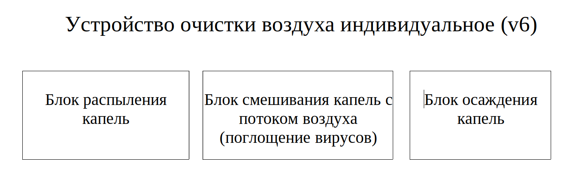

 На внутреннюю (конусную) сторону вращающегося с высокой скоростью диска-распылителя по капилляру дозированно подается вода. Капелька, попавшая в центр чашки, за счет центробежной силы движется по слегка конусной поверхности, при этом разбиваясь на мелкие капли и заряжаясь за счет трения о поверхность диска. Полученные заряженные мелкодисперсные частицы уносятся с потоком воздуха от небольшой крыльчатки на обратной стороне диска, создающая при высоких скоростях вращения турбулентный поток. Воздух с мелкодисперсными частицами проходит через спиральный участок корпуса, в котором происходит перезарядка вирусных частиц, их поглощение водяными каплями и укрупнение водяных капель. Мелкодисперсные капли воды заряжаются за счет трибоэлектрического эффекта положительным зарядом, а поверхность распылительного диска - отрицательным. Напряжение диска используется в блоке сбора капель на электроде-сетке. Кроме того, входное отверстие блока сбора капель и электрод-сетки выполнены таким образом, что капли собираются за счет центробежной силы, как в воздушном сепараторе "циклон". Таким образом обеспечивается два механизма поглощения биологического аэрозоля содержащего вирус: механический (за счет слияния водяных капель, обеспечиваемого их поверхностным натяжением, и их последующем сборе с помощью “циклона”) и электростатический (за счет целенаправленного притяжения нейтрально-вирусной и заряженной частицы, перезарядка вирусной частицы за счет слияния с заряженной капелькой воды и их сбор на высоковольтном электроде осаждения). 

Конечно, это всего лишь идея, требующая доработки и проверки.

 Мы приглашаем всех желающих в виртуальный коллектив, или же, если Вы имеете такую возможность, проведите одну из частей этих работ самостоятельно. В связи с текущими событиями, возможно, такой фильтр понадобится каждому. Скорость успешного создания такого устройства определит количество жизней им спасенных. Производство таких фильтров не является технически сложным, под его изготовление можно переоборудовать многие производственные мощности.

Практическая конструкция фильтра

Все блоки сделаны в стиле чернильницы-непроливайки.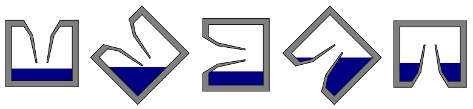

*Принцип чернильницы-непроливайки*

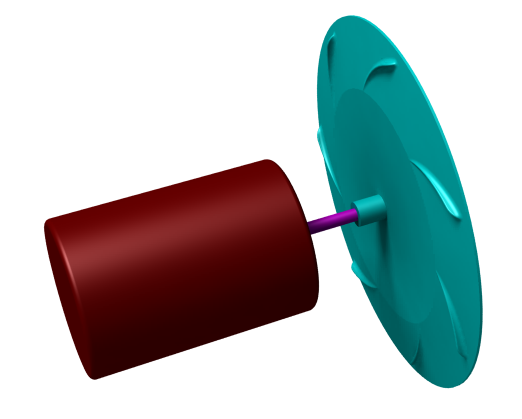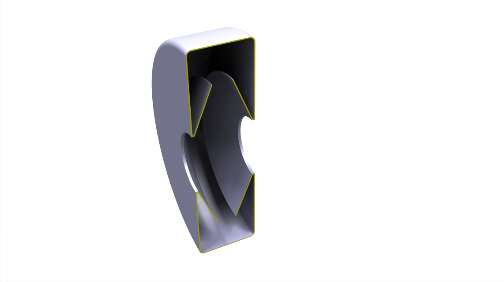 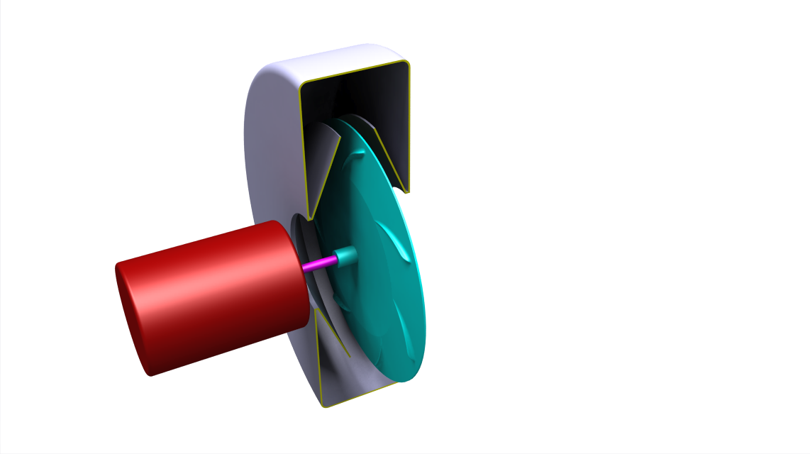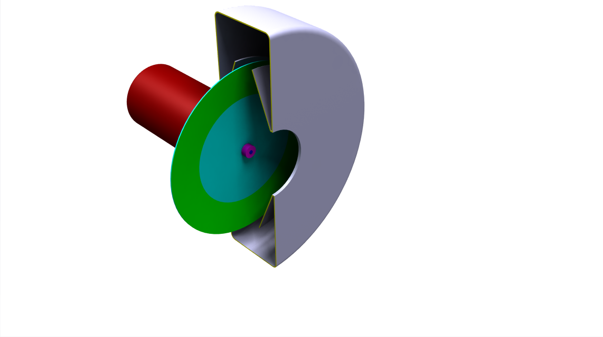

*Мотор с диском и камера-непроливайка образующие блок распыления капель*

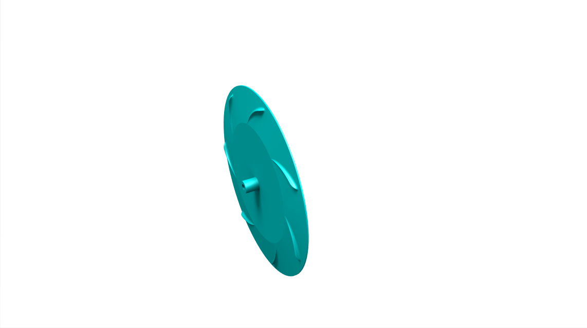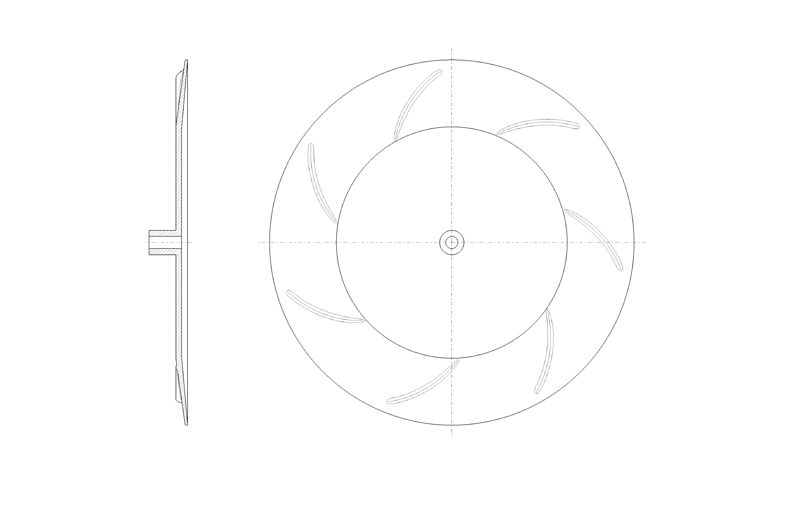

*Диск формирования капель*

На диске имеются радиальные лопасти, формирующие направленный поток воздуха. Внутренняя поверхность диска имеет конический участок с насечками для образования микронных капель жидкости под действием центробежной силы. Эти капли под действием трибоэлектрического эффекта приобретают положительный заряд.

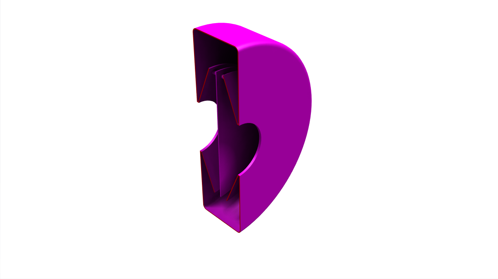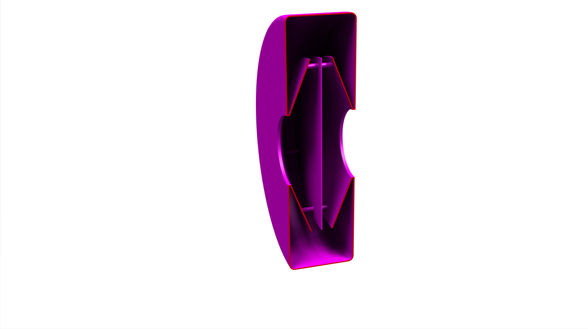

*Блок смешивания взвешенных капель с воздухом*

Камера разделена перегородкой, формирующей турбулентный поток при прохождении через нее воздуха. Основная задача - дать возможность каплям притянуть на свою поверхность опасные вирусы. 

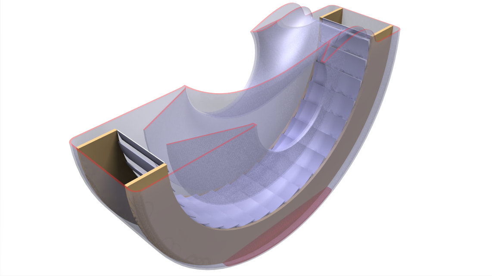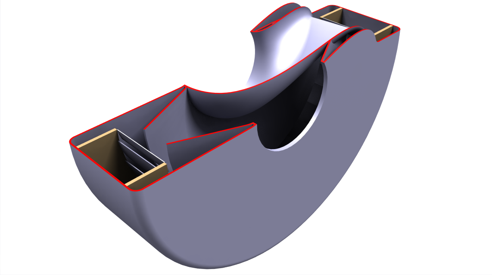

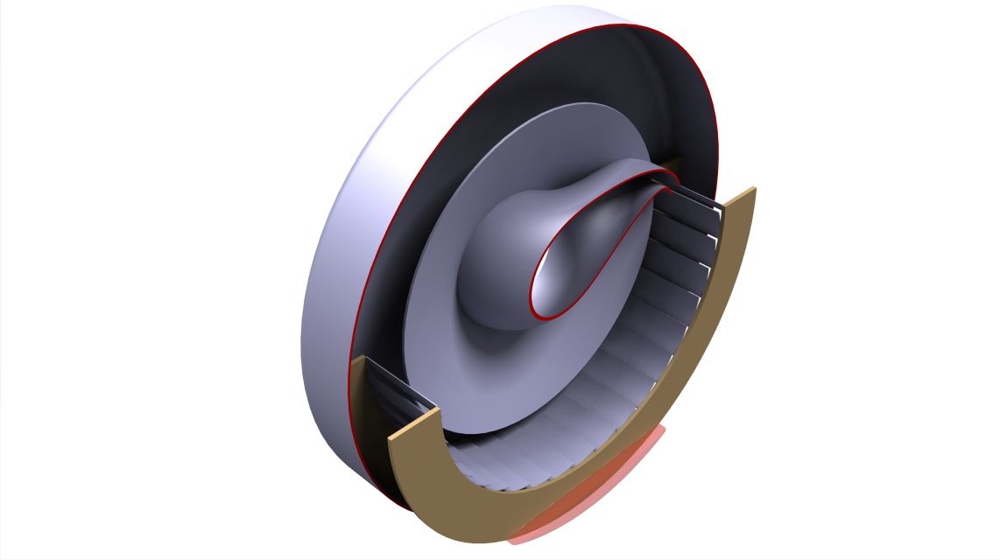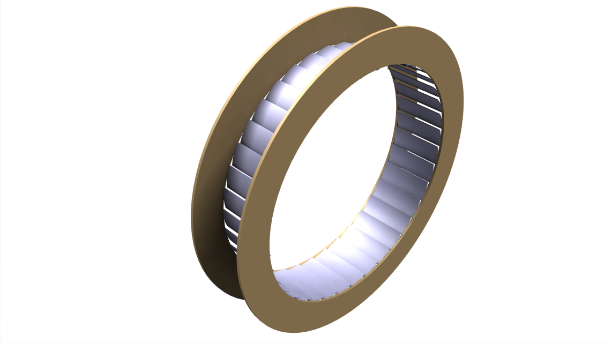

*Блок осаждения капель*

Блок содержит направляющие сопло, формирующее вихревой поток в камере. Камера устроена по принципу фильтра "циклон". В зоне “непроливайки” расположена металлическая решетка, обеспечивающая электростатическое осаждение заряженных капель с вирусом. “Непроливайки” камер смешения и осаждения соединены в отсеке воды и содержат дозатор обеззараживающего вещества и клапан для слива отработанной воды. Очищенный воздух попадает в центральное выходное отверстие.

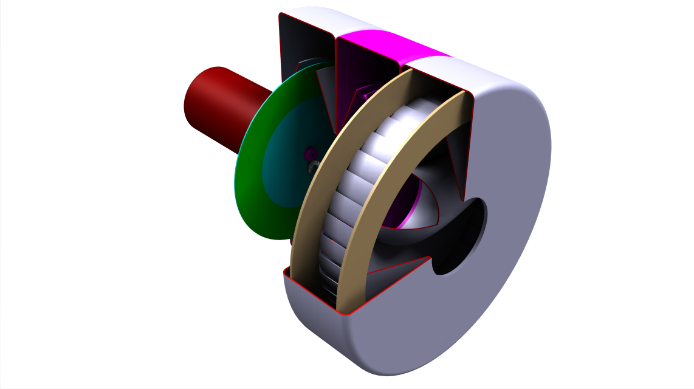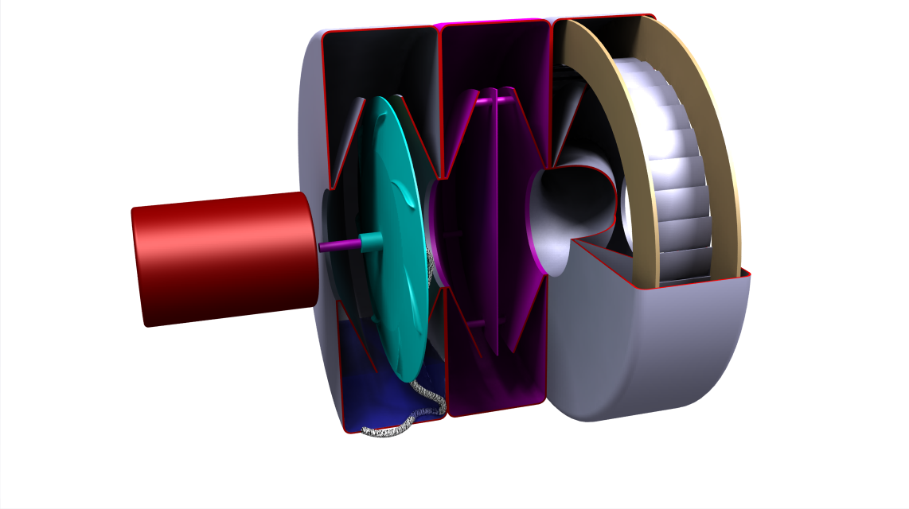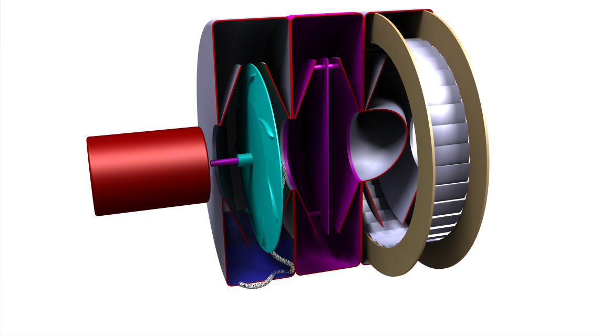

*Общий вид устройства в сборе*

На заключительной стадии очистки воздух проходит через силикагель, который поглощает избыток влаги. Силикагель играет роль индикатора эффективной работы "циклона" и электростатического осадителя. Появление в нем жидкости говорит о неисправности фильтра (очистка работает и без помощи силикагеля, он просто является гарантией безопасности в случае поломки устройства).

**Предложение по шлему**

Дизайнерское решение фильтра представляет собой ожерелье, закрепляемое на воротнике любой одежды с помощью магнитных защелок, то есть один магнит расположен внутри ожерелья, а второй - под одеждой или воротником. Если конструкцию корпуса сделать в виде кольца-ожерелья, имеющего некоторую гибкость, и по верхнему краю этого ожерелья создать кольцевую канавку, в которой можно было бы зажать пленку с помощью фиксатора, то шлем можно было бы изготовить из любой плоской пленки в виде "оригами", закрепленного на корпусе и герметизирующегося упругой застежкой на шее. Внутри ожерелья находится фильтр для входного и выходного потоков воздуха из шлема, и аккумулятор для питания электромотора. Отсутствие заряда в аккумуляторе или неисправность работы электромотора индицируется визуально уменьшением натяжения тонкопленочного шлема и прекращением работы демпфера при вдохе и сигнализирует о том, что шлем  необходимо снять. Демпфер существует, чтобы шлем не надувался и сдувался при каждом вдохе. Демпфер для компенсации вдоха выполнен в отдельной камере в виде надувающаяся резинового шарика в трубке, соединяющей шлем с атмосферой. Это обязательный элемент для всех шлемов, поскольку он работает, как аварийный клапан, когда из-за прекращения поддува воздуха (например, при неисправности или разряда аккумулятора) давление в шлеме падает - шарик сдувается и разгерметизирует шлем. 

Расход воздуха фильтра определяется потреблением человека ориентировочно в среднем 10 л свежего воздуха в минуту, умноженное на некоторый коэффициент избыточности 2. Итого, если принять время автономной работы порядка 12 часов, то мы получаем 1440 литров воздуха. Давление, создаваемое вентилятором, должно обеспечивать этот расход с учетом прохождения через отверстия малого сечения фильтра "циклон", сопротивления камеры с силикагелем, а также, сопротивления шлема. Расход жидкости и объем, который необходимо держать в камере распыления, определяется размером распыленных частиц (мы ориентируемся на 1 мкм) и объемом воздуха прокачиваемого через фильтр. Удельная площадь поверхности равна произведению коэффициента формы k на величину обратную к диаметру капли. Для микронной шарообразной капли 1 кубический метр воды распылиться в 6 на 10 в 6 степени метров квадратных поверхности капель.

Диаметр бусинок ожерелья определяется минимальным диаметром нашего диска в корпусе (ориентировочно 5 см). Грубое испытание этого устройства можно провести: 1) на наличие высокого напряжения с помощью школьного или самодельного (из двух полосок папиросной бумаги) электрометра. 2) на способность поглощать мелкодисперсной частицы с помощью сигаретного дыма (при работе фильтра подаваемый во входного отверстия дым должен полностью поглощаться и, не давать следов запаха в выходном отверстии).

Проверить работу "циклона" можно отключив блок электрического осаждения по наличию воды в силикагеле. Устройство издает слабый белый шум при распылении капель, который является индикатором нормальной работы.

**О нас**

К сожалению, наш коллектив из пяти человек имеет ограниченные возможности. Я, Вероника, написала эту статью и готова отвечать на Ваши вопросы. Автор концептуальных идей - мой отец (Игорь). Если есть вопросы - задавайте, как можно скорее. Он лежит парализованный и у него осталось очень мало времени. Еще один человек специализируется на 3D-моделировании (Юрий). И последний готов контактировать со всеми заинтересованными лицами по изготовлении фильтра и организации массового производства (Валерий). Все наши работы мы будем вести на GitHub (https://github.com/FilterCOVID-19/FilterCOVID-19_RUS). Пожалуйста, присоединяйтесь. 

Гарантии безопасности: пользователь делает все на свой страх и риск. Лицензия свободная.

